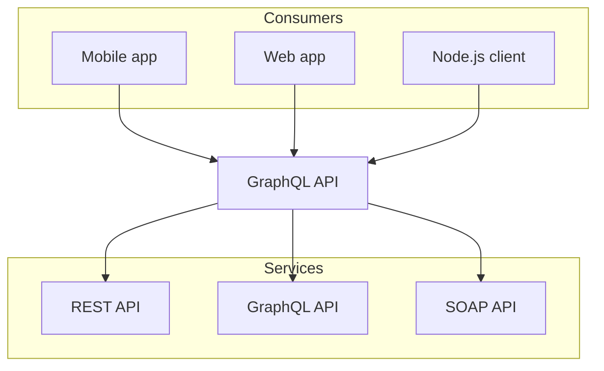

## Test table

| Left | Center | Right | Right | Right | Right | Right | Right | Right | Right |
| ---- | :----: | ----: | ----: | ----: | ----: | ----: | ----: | ----: | ----: |
| ss2  |  333   |  3232 |  3232 |  3232 |  3232 |  3232 |  3232 |  3232 |  3232 |
|      |  222   |  3232 |  3232 |  3232 |  3232 |  3232 |  3232 |  3232 |  3232 |
|      |   23   |       |       |       |       |       |       |       |       |

The **Pythagorean equation**: $a=\sqrt{b^2 + c^2}$.

<table>
  <thead>
    <tr>
      <th>left</th>
      <th align="center">center</th>
      <th align="right">right</th>
    </tr>
  </thead>
  <tbody>
    <tr>
      <td>foo</td>
      <td align="center">bar</td>
      <td align="right">baz</td>
    </tr>
    <tr>
      <td>banana</td>
      <td align="center">apple</td>
      <td align="right">kiwi</td>
    </tr>
  </tbody>
</table>

<table>
  <thead>
    <tr>
      <th>Country</th>
      <th>Flag</th>
    </tr>
  </thead>
  <tbody>
    {[
      { country: 'France', flag: '🇫🇷' },
      { country: 'Ukraine', flag: '🇺🇦' }
    ].map(item => (
      <tr key={item.country}>
        <td>{item.country}</td>
        <td>{item.flag}</td>
      </tr>
    ))}
  </tbody>
</table>

import { Callout } from 'nextra/components'
 
<Callout emoji="👾">
  **Space Invaders** is a 1978 shoot 'em up arcade game developed by Tomohiro
  Nishikado.
</Callout>

<Callout type="info" emoji="ℹ️">
  Today is Friday.
</Callout>

<Callout type="warning" emoji="⚠️">
  This API will be deprecated soon.
</Callout>

<Callout type="error" emoji="️🚫">
  This is a dangerous feature that can cause everything to explode.
</Callout>

import { useSSG } from 'nextra/ssg'
 
export const getStaticProps = ({ params }) => {
  return fetch(`https://api.github.com/repos/jcstein/gm-portal`)
    .then(res => res.json())
    .then(repo => ({
      props: {
        // We add an `ssg` field to the page props,
        // which will be provided to the Nextra `useSSG` hook.
        ssg: {
          stars: repo.stargazers_count
        }
      },
      // The page will be considered as stale and regenerated every 60 seconds.
      revalidate: 60
    }))
}
 
export const Stars = () => {
  // Get the data from SSG, and render it as a component.
  const { stars } = useSSG()
  return <strong>{stars}</strong>
}
 
GM Portal has <Stars /> stars on GitHub!
